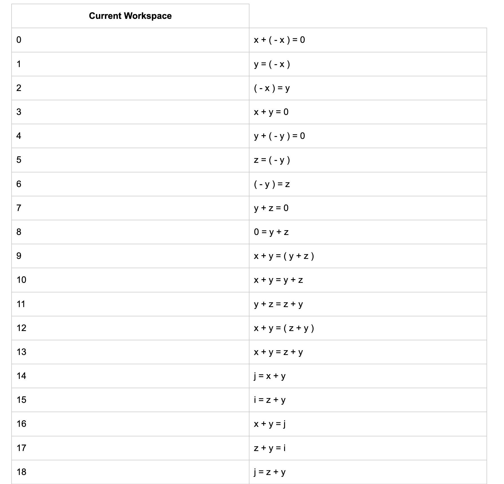
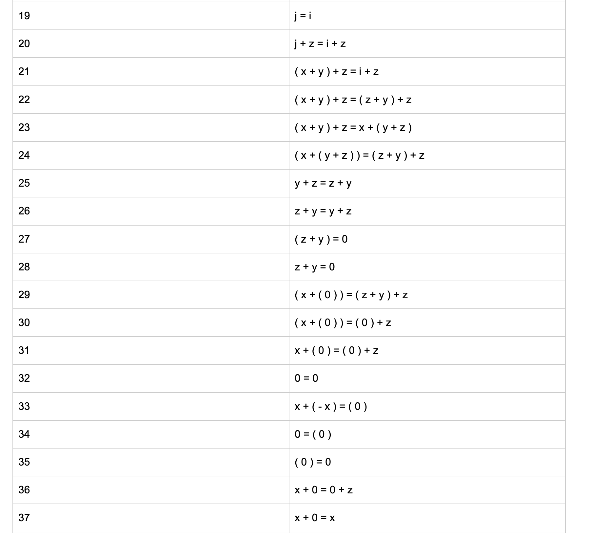
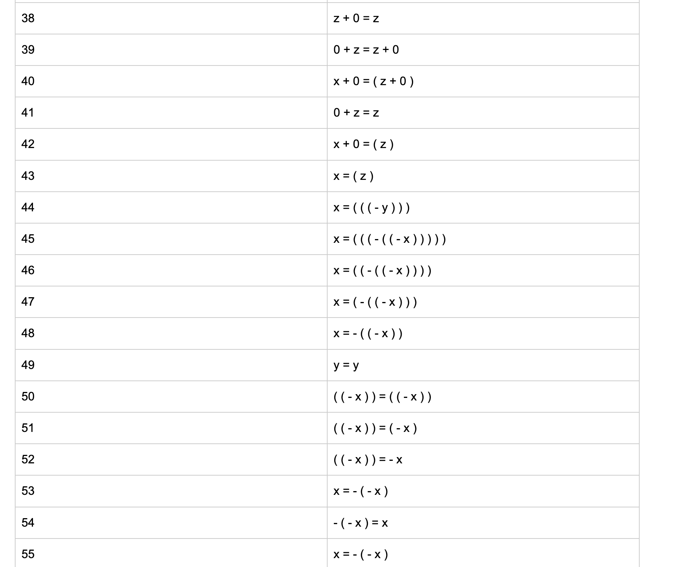
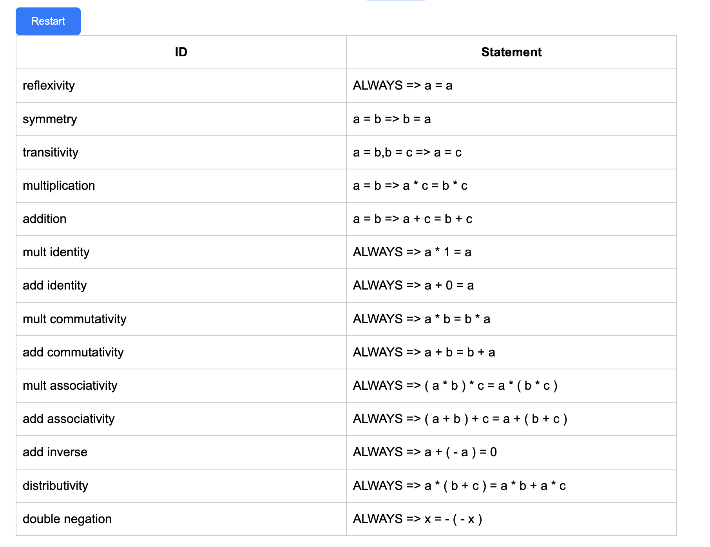

# Number-Theory-Proof-Player
Javascript code that allows users to create mathematical proofs from base axioms.

For an example, these following images demonstrate how to prove double negation, or x = - ( - x )

The theorem can be added and be used in the future:

